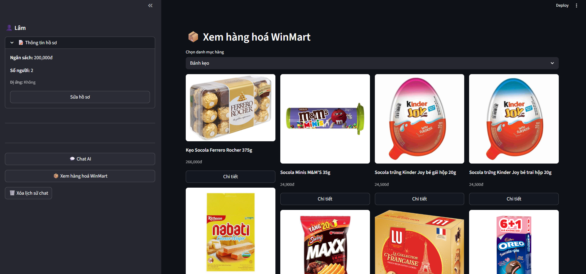
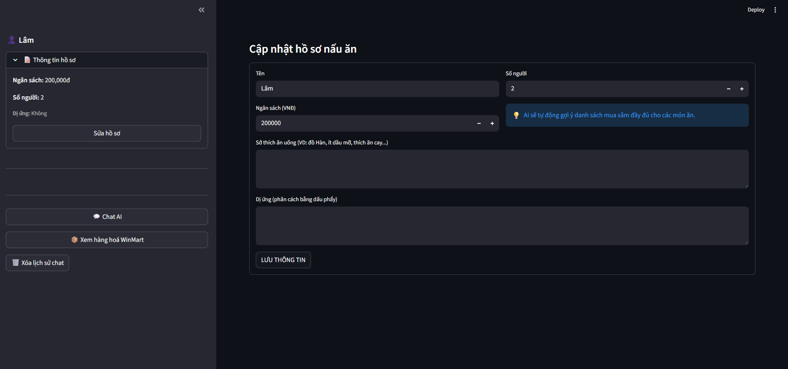

# 🥗 SmartMealChatBot

Một ứng dụng chatbot AI thông minh để lập kế hoạch bữa ăn và tìm kiếm sản phẩm từ WinMart, được hỗ trợ bởi Google Gemini LLM và công nghệ vector search tiên tiến.

### Shop check

### User's Infor

### Recommended Meal

## ✨ Tính Năng Chính

- 🤖 **Chatbot Thông Minh**: Tương tác tự nhiên qua Gemini LLM
- 🍽️ **Lập Kế Hoạch Bữa Ăn**: Gợi ý menu phù hợp với ngân sách và số người
- 🔍 **Tìm Kiếm Sản Phẩm**: Tìm kiếm thông minh từ cơ sở dữ liệu WinMart
- 🎯 **Nhận Diện Ý Định**: Xác định ý định người dùng (lập kế hoạch, tìm kiếm, hỏi thông tin)
- 👥 **Hồ Sơ Cá Nhân**: Quản lý thông tin người dùng, sở thích, dị ứng
- 💾 **Lưu Trữ Bộ Nhớ**: Ghi nhớ cuộc hội thoại và cố gắng cá nhân
- ⚡ **Vector Search**: Tìm kiếm ngữ nghĩa nhanh chóng với embeddings

## 🏗️ Kiến Trúc Hệ Thống

```
┌─────────────────────────────────────────────────────────┐
│              Streamlit UI Interface                     │
└────────────────────┬────────────────────────────────────┘
                     │
┌────────────────────▼────────────────────────────────────┐
│         Graph Worker (LangGraph Orchestrator)           │
│  ┌──────────────────────────────────────────────────┐   │
│  │  Intent Agent → Info Gatherer → Product Search  │   │
│  │  Meal Planner → General Agent (Routing)         │   │
│  └──────────────────────────────────────────────────┘   │
└────────────┬──────────────────────┬────────────────────┘
             │                      │
    ┌────────▼─────────┐   ┌────────▼──────────────┐
    │   MongoDB        │   │  Vector Search       │
    │  (Product Repo)  │   │  (Embeddings)        │
    └──────────────────┘   └─────────────────────┘
             │
    ┌────────▼──────────────┐
    │  Google Gemini API    │
    │  (LLM Intelligence)   │
    └───────────────────────┘
```

## 🚀 Cài Đặt

### Yêu Cầu
- Python >= 3.10
- MongoDB
- API Key từ Google Gemini

### Các Bước

1. **Clone repository**
```bash
git clone <repository-url>
cd SmartMealChatBot
```

2. **Tạo virtual environment**
```bash
python -m venv .venv
.venv\Scripts\Activate.ps1  # Windows
source .venv/bin/activate   # macOS/Linux
```

3. **Cài đặt dependencies**
```bash
pip install -r requirements.txt
# hoặc
pip install -e .
```

4. **Cấu hình environment**
```bash
cp .env.example .env
# Thêm GEMINI_API_KEY vào .env
```

5. **Khởi động ứng dụng**
```bash
streamlit run app.py
```

Ứng dụng sẽ chạy tại: `http://localhost:8501`

## 💻 Cách Sử Dụng

### 1. Điền Hồ Sơ (Sidebar)
- Tên của bạn
- Ngân sách ăn (VNĐ)
- Số người ăn
- Các mặt hàng trong tủ (nếu có)
- Dị ứng thực phẩm

### 2. Gửi Tin Nhắn
Các ví dụ câu hỏi:
- "Lập kế hoạch thực đơn cho 4 người với 500k"
- "Tìm sản phẩm thịt tươi chất lượng"
- "Gợi ý món ăn từ nguyên liệu tôi có"
- "Có thể nấu gì từ cá, tôm và rau?"

### 3. Xem Kết Quả
- Gợi ý menu chi tiết
- Danh sách sản phẩm WinMart với giá
- Hướng dẫn nấu ăn
- Thông tin dinh dưỡng

## 📁 Cấu Trúc Project

```
SmartMealChatBot/
├── app.py                      # Ứng dụng Streamlit chính
├── pyproject.toml              # Cấu hình Project
├── Makefile                    # CLI commands
├── docker-compose.yml          # Docker setup
├── configs/
│   ├── agents.yaml             # Cấu hình các agent
│   ├── logging.yaml            # Cấu hình logging
│   └── settings.yaml           # Cài đặt chung
├── data/
│   ├── raw/                    # Dữ liệu thô từ WinMart
│   ├── processed/              # Dữ liệu xử lý
│   └── embedding/              # Vector embeddings
├── src/
│   ├── agents/                 # Agent logic
│   │   ├── base_agent.py
│   │   ├── intent_agent.py     # Nhận diện ý định
│   │   ├── info_gatherer_agent.py
│   │   ├── ingredient_matcher_agent.py
│   │   ├── meal_planner_agent.py
│   │   ├── product_search_agent.py
│   │   ├── general_agent.py
│   │   └── orchestrator.py
│   ├── core/                   # Utilities cơ bản
│   │   ├── logger.py
│   │   ├── memory.py
│   │   └── utils.py
│   ├── database/               # MongoDB integration
│   │   ├── mongo_client.py
│   │   ├── indexes.py
│   │   └── repositories/
│   ├── embeddings/             # Vector embeddings
│   │   └── embedding_service.py
│   ├── graph/                  # LangGraph orchestration
│   │   ├── state.py
│   │   ├── nodes.py
│   │   └── worker.py
│   ├── llm/                    # LLM integration
│   │   └── llm_client.py
│   ├── retrieval/              # Vector search
│   │   └── vector_search.py
│   ├── etl/                    # Data pipeline
│   │   ├── cleaner.py
│   │   ├── loader.py
│   │   ├── category_mapper.py
│   │   └── crawl_data.py
│   └── tools/                  # External tools
│       └── product_search_tool.py
├── scripts/                    # Helper scripts
│   ├── run_etl.py
│   └── build_embeddings.py
├── notebooks/                  # Jupyter notebooks
│   ├── crawl_data.ipynb
│   └── add_main_category.ipynb
├── test/                       # Unit & integration tests
├── demo/
│   └── image.png              # Demo screenshot
└── README.md                   # This file
```

## 🔄 Luồng Xử Lý

### 1. Data Pipeline (ETL)
```
Raw WinMart Data (JSON)
    ↓
Cleaner (làm sạch + chuẩn hóa)
    ↓
Category Mapper (ánh xạ danh mục)
    ↓
Loader (lưu vào MongoDB)
    ↓
Embeddings Builder (tạo vectors)
```

### 2. Chat Request Flow
```
User Input
    ↓
Intent Agent (nhận diện: plan/search/info)
    ↓
   ├─→ Meal Planner Agent
   ├─→ Product Search Agent
   ├─→ Info Gatherer Agent
   └─→ General Agent
    ↓
LangGraph State Management
    ↓
Google Gemini LLM
    ↓
User Response
    ↓
Memory Repository (lưu trữ)
```

## 🛠️ Công Nghệ Stack

| Component | Technology |
|-----------|------------|
| **UI Framework** | Streamlit |
| **LLM** | Google Gemini |
| **Orchestration** | LangGraph |
| **Database** | MongoDB |
| **Vector Search** | Vector Embeddings + Similarity Search |
| **Language** | Python 3.10+ |
| **DevOps** | Docker, Docker Compose |

## 📊 Dữ Liệu

### Nguồn Dữ Liệu
- WinMart product catalog (JSON)
- 13 danh mục sản phẩm:
  - Bánh, kẹo
  - Đồ uống
  - Gia vị
  - Rau, quả
  - Sữa
  - Thịt, hải sản
  - Thực phẩm chế biến
  - Thực phẩm đông lạnh
  - Thực phẩm khô
  - ...và nhiều hơn nữa

### Xử Lý Dữ Liệu
```bash
# Chạy ETL pipeline
make run-etl

# Hoặc trực tiếp
python scripts/run_etl.py

# Xây dựng embeddings
python scripts/build_embeddings.py
```

## 🧪 Testing

```bash
# Chạy tất cả tests
pytest

# Chạy với coverage
pytest --cov=src

# Test cụ thể
pytest test/test_agent.py -v
```

## 📝 Cấu Hình

### configs/agents.yaml
```yaml
# Định nghĩa các agent và prompt template
agents:
  intent_agent:
    model: "gemini-pro"
    temperature: 0.7
  meal_planner_agent:
    model: "gemini-pro"
    temperature: 0.6
  # ...
```

### configs/settings.yaml
```yaml
# Cài đặt chung của hệ thống
database:
  url: "mongodb://localhost:27017"
  name: "smartmeal_db"
llm:
  api_key: "${GEMINI_API_KEY}"
```

## 📚 Các Notebook Hữu Ích

- **crawl_data.ipynb**: Hướng dẫn crawl dữ liệu từ WinMart
- **add_main_category.ipynb**: Thêm danh mục chính cho sản phẩm

## 🤝 Hôm Nay Tôi Có Thể Giúp Gì?

- Lập kế hoạch bữa ăn
- Tìm kiếm sản phẩm
- Gợi ý công thức nấu ăn
- Trả lời câu hỏi về dinh dưỡng


## 📧 Liên Hệ

- **Author**: Lâm 
- **Email**: vlam711003@gmail.com
- **GitHub**: [https://github.com/LamQuC/SmartMealChatBot]

---

**Made with ❤️ for Vietnamese food lovers** 🇻🇳🍜

